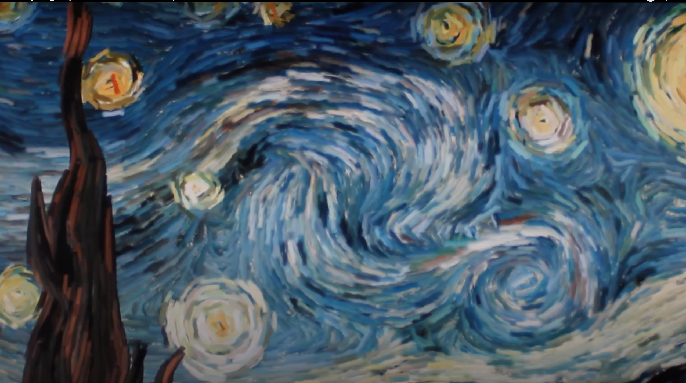
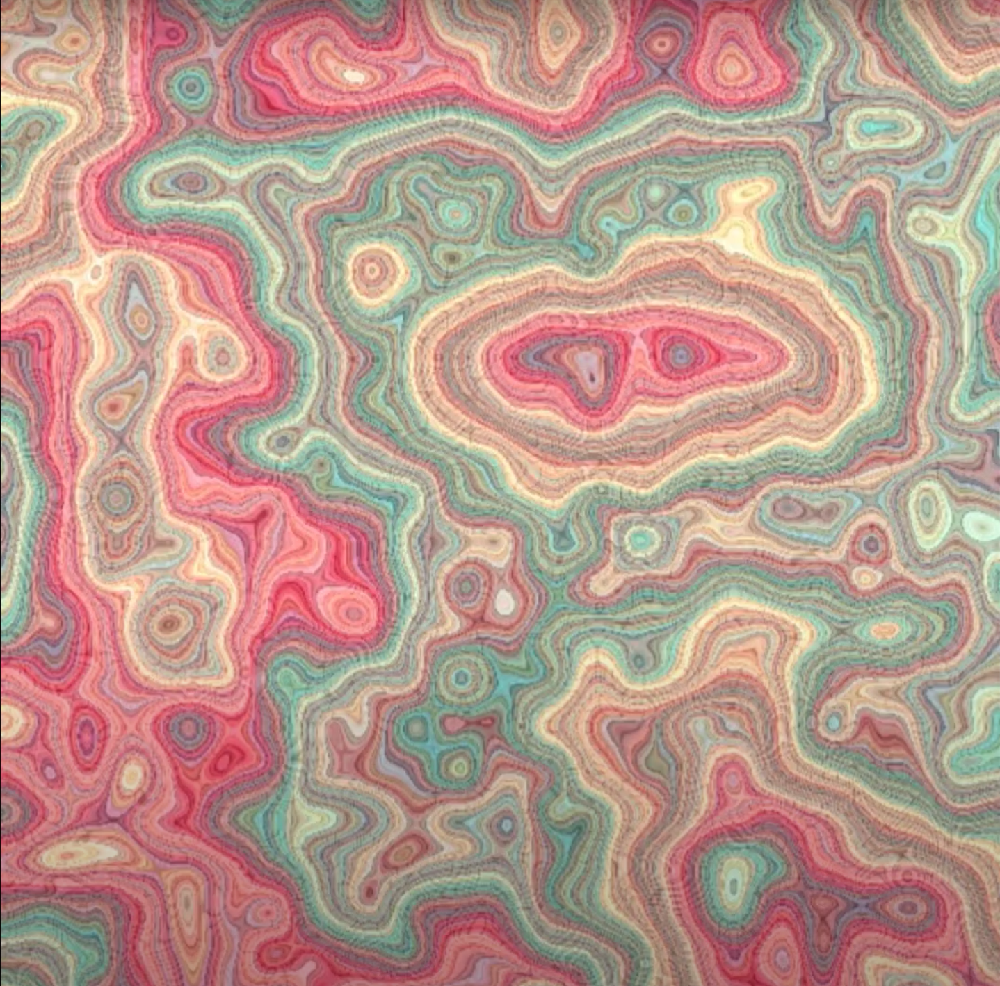

# **Quiz-8**
## Part 1: Imaging Technique Inspiration

I was inspired by the **“Starry Night interactive animation”**, which brings Van Gogh’s painting to life through motion and user interaction. 

                                                               (https://artof01.com/vrellis/works/starry_night.html)

For my assignment, I’d like to animate Edvard Munch’s ***The Scream***.

1. When the user types **“c-r-a-z-y”** on the keyboard, the **sky** and the **figure’s screaming face** will distort and swirl, while the bridge remains static.  
2. Typing **“calm down”** will return the painting to its originally still state.

This technique allows me to fully apply my **coding knowledge** and **creativity**, combining **emotional expression** with **interactive design** in a reinterpretation of an iconic artwork.

## Part 2: Coding Technique Exploration
To bring ***The Scream*** to life, I plan to use **Perlin noise** combined with **keyboard input detection**.  
- **Perlin noise** creates the animation of the swirling sky and screaming figure.  
- **Keyboard inputs** will allow the user to interact with the assignment.  

### **Example** 1: Perlin Noise & Code

https://www.youtube.com/watch?v=Qf4dIN99e2w

### **Example 2**: Keyboard Inputs Code

https://p5js.org/reference/p5/keyPressed/